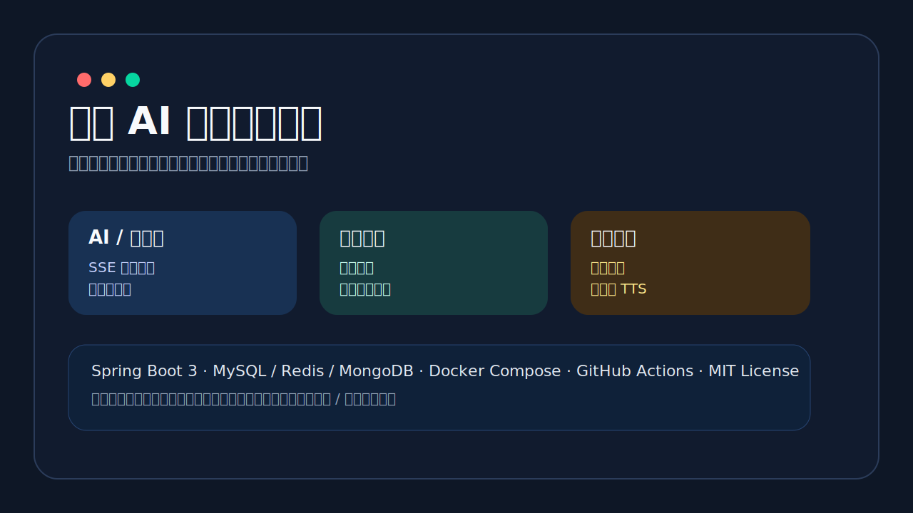
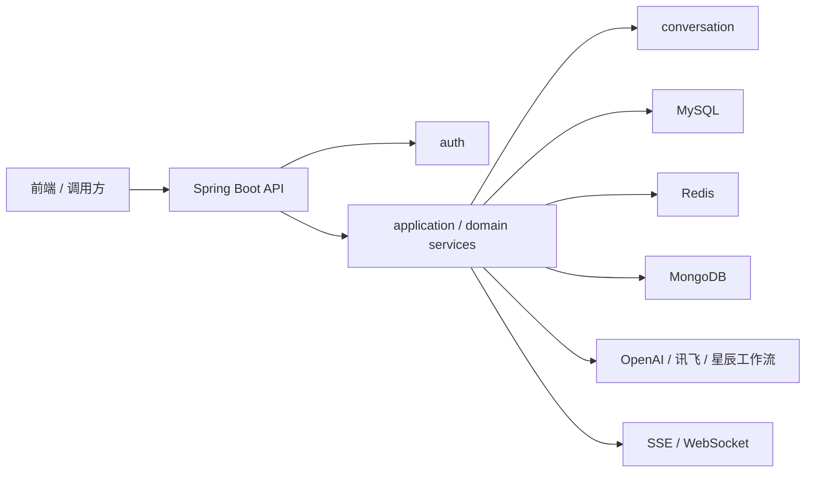

# 讯智 AI 智能助手后端



一个面向 AI 对话、智能体会话、面试编排、语音转写和长文本语音合成场景的 Spring Boot 3 后端项目。仓库目标不是仅仅“能跑通业务”，而是以展示级开源作品的标准呈现完整的后端工程能力：清晰分层、稳定接口、可本地运行、可 Docker 部署、可协作维护。

演示视频：[Bilibili 项目展示](https://www.bilibili.com/video/BV1o7nXzVEVm/)

## 核心亮点

- 模块化单体架构，按 `auth / ai / agent / interview / conversation / media / shared` 收敛职责边界
- 同时支持 HTTP、SSE、WebSocket 三类交互链路
- 覆盖 AI 对话、智能体会话、面试问答编排、实时语音转写、长文本 TTS 等核心能力
- 提供本地开发链路和 Docker 一键演示链路
- 使用 GitHub Actions 执行统一 `mvn verify` 校验
- 主文档、接口总览、架构说明全部收敛到仓库内 Markdown 文档

## 演示导览

建议按下面顺序浏览仓库：

1. 先看本页，了解项目定位、能力范围和运行方式
2. 再看 [快速启动指南](docs/quick-start-zh.md)
3. 然后看 [后端接口总览](docs/backend-api-overview-zh.md)
4. 最后看 [后端架构说明](docs/backend-architecture-zh.md)

## 架构简图



## 功能入口

- AI 对话：`/api/xunzhi/v1/ai/**`
- 智能体会话：`/api/xunzhi/v1/agents/**`
- 面试会话与记录：`/api/xunzhi/v1/interview/**`
- 长文本语音合成：`/api/xunzhi/v1/xunfei/tts/**`
- 实时语音转写：`/api/xunzhi/v1/xunfei/audio-to-text/{userId}`
- WebSocket 管理接口：`/api/xunzhi/v1/websocket/**`
- 题库采集与审核：`/api/xunzhi/v1/collection/**`
- 健康检查：`/actuator/health`

## 技术栈

- Java 17
- Spring Boot 3
- Spring AI
- MyBatis Plus
- MySQL
- MongoDB
- Redis
- Sa-Token
- WebSocket / SSE
- Maven / GitHub Actions / Docker Compose

## 快速开始

### 方式一：Docker 演示链路

```bash
docker compose up -d --build
curl http://localhost:8002/actuator/health
```

默认端口：

- backend: `8002`
- MySQL: `3306`
- MongoDB: `27017`
- Redis: `6379`

### 方式二：本地开发链路

前置依赖：

- JDK 17+
- Maven Wrapper
- MySQL 8+
- MongoDB 7+
- Redis 7+

启动命令：

```bash
./mvnw -B -ntp clean verify
./mvnw -B -ntp -pl admin -am spring-boot:run
curl http://localhost:8002/actuator/health
```

更详细的环境准备、数据库说明和启动步骤见 [快速启动指南](docs/quick-start-zh.md)。

## 接口文档入口

- [快速启动指南](docs/quick-start-zh.md)
- [后端接口总览](docs/backend-api-overview-zh.md)
- [后端架构说明](docs/backend-architecture-zh.md)

仓库中保留了更细的联调、PRD 和分阶段实施文档，统一放在 [`docs/`](docs/) 目录下。

## 目录说明

```text
virtual-character-backend/
├─ admin/                      # 后端主应用模块
│  ├─ src/main/java/           # 业务代码
│  ├─ src/main/resources/      # 配置、SQL、Mapper
│  └─ src/test/java/           # 单元测试与边界校验
├─ docs/                       # 项目文档与展示素材
├─ .github/                    # CI、Issue/PR 模板
├─ Dockerfile                  # 后端镜像构建
├─ docker-compose.yml          # 本地演示环境编排
└─ pom.xml                     # Maven 聚合工程
```

## 运行与存储目录

- 健康检查：`GET /actuator/health`
- 上传临时目录：`xunzhi-agent.storage.upload-temp-dir`
- 音频临时目录：`xunzhi-agent.storage.audio-temp-dir`
- 日志目录：`xunzhi-agent.storage.log-dir`

默认情况下，这些目录会落在用户目录下的 `.xunzhi-agent/`，避免向源码目录写入运行时文件。Docker 运行时则挂载到容器内 `/app/data` 和 `/app/logs`。

## 测试与 CI

统一校验入口：

```bash
./mvnw -B -ntp clean verify
```

当前 CI 覆盖：

- Maven 构建与测试
- JDK 17 基线校验
- 仓库元数据与文档格式检查

工作流文件见 [`.github/workflows/backend-ci.yml`](.github/workflows/backend-ci.yml)。

## 开源协作

- 许可证：[MIT](LICENSE)
- 贡献指南：[CONTRIBUTING.md](CONTRIBUTING.md)
- 行为准则：[CODE_OF_CONDUCT.md](CODE_OF_CONDUCT.md)
- 安全说明：[SECURITY.md](SECURITY.md)

## 发布说明

当前仓库仍保留开发期配置结构，真实密钥脱敏和最终公开发布前的安全清理将在后续阶段单独处理。本仓库本轮重点是把架构边界、运行链路、文档门面和开源协作面收敛到展示级标准。
