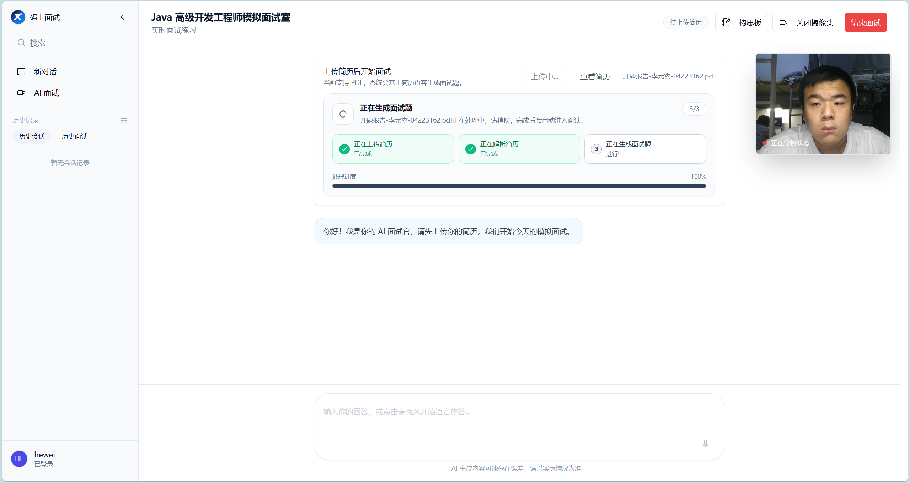
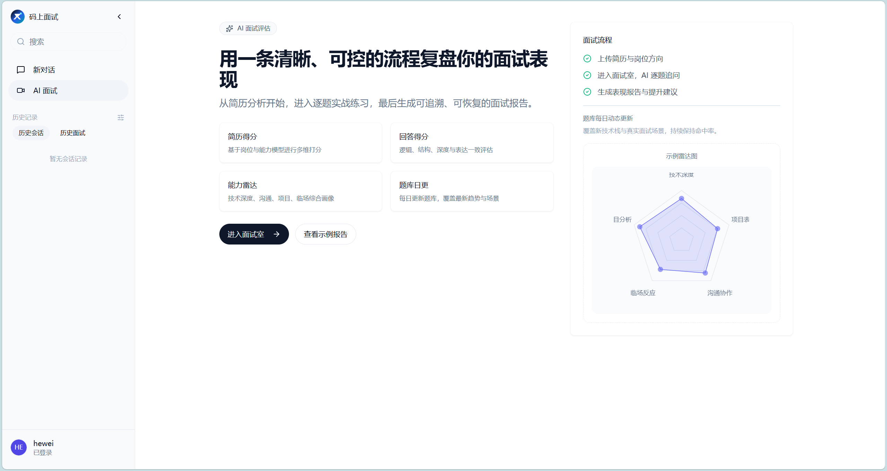

# 码上面试平台 AI-Meeting

> 面向简历解析、模拟面试、AI 追问评估和实时语音交互的智能面试系统后端。<br>
> 这是我用于简历与作品集展示的真实项目，重点展示 Spring Boot 工程化、AI Agent 编排、长会话状态治理、分布式幂等和实时媒体链路设计能力。

<div align="center">

[](https://openjdk.org/)
[](https://spring.io/projects/spring-boot)
[](https://spring.io/projects/spring-ai)
[](https://www.mysql.com/)
[](https://www.mongodb.com/)
[](https://redis.io/)
[](LICENSE)

</div>


## 项目链接

- 后端仓库：[https://github.com/Bersulang/ai-meeting](https://github.com/Bersulang/ai-meeting)
- 前端仓库：[https://github.com/lishuangqiang/AI-Meeting-Frontend](https://github.com/lishuangqiang/AI-Meeting-Frontend)
- 演示视频：[Bilibili 项目展示](https://www.bilibili.com/video/BV1ccR9B9EEm/?share_source=copy_web&vd_source=2147a1677cc5a940112d07c6f03c4bc9)

## 项目简介

AI-Meeting 是一个基于 Spring Boot 3、Java 17、Spring AI、MySQL、MongoDB、Redis 和讯飞语音能力构建的 AI 面试平台后端。系统围绕“上传简历 -> 生成面试题 -> 多轮答题 -> AI 评分与追问 -> 生成报告”的主链路展开，同时提供通用 AI 对话、Agent 会话、实时语音转写、长文本语音合成、用户认证和后台配置能力。

我在这个项目中重点承担后端核心链路建设与工程治理工作，包括面试状态机、AI 调用防重、分布式 Single-flight、长会话恢复、MongoDB 运行态快照、Redis 幂等锁、SSE/WebSocket 实时通信、讯飞 AST/ TTS 接入和 CI/容器化部署等模块。

## 核心亮点

### 1. 简历驱动的 AI 模拟面试

- 上传 PDF 简历后，由简历评分面试官 Agent 解析候选人经历，生成结构化面试题、简历评分和改进建议。
- 面试流程由“出题官、提问官、评分官、追问官、神态分析官”等多个 Agent 协同完成。
- 答题后同步返回评分、反馈、追问建议和下一轮问题，模拟真实面试中的深挖过程。
- 面试结束后生成完整复盘报告，包含问题、回答、得分、反馈、综合建议和雷达图。

### 2. 面试答题链路的幂等与一致性治理

- 使用题级分布式锁、请求指纹和结果回放机制，保证同一题答题请求不会被重复处理。
- 通过 Redis Lua、Fencing Token、处理态 TTL 和异步补偿机制处理重复提交、网络抖动和长尾任务。
- 将评分、追问、抽题、神态分析等高成本 AI 调用纳入统一防重框架，降低重复扣费和状态错乱风险。
- 面向异常场景设计失败分类、超时接管和本地降级策略，提升长流程稳定性。

### 3. 长会话状态恢复

- 使用 Redis 承载面试热状态，MongoDB 持久化运行态快照和历史消息。
- 支持会话中断后恢复当前问题、已答轮次、追问状态、评分结果和报告数据。
- 引入 CAS 并发保护、热冷分层快照、懒加载恢复和异步补偿，避免 Redis 异常导致会话不可恢复。

### 4. AI Agent 与模型统一接入

- 基于 Spring AI 和 OpenAI 兼容协议接入可替换的大模型服务。
- 通过 Agent 配置表管理 API Key、Secret、FlowId、系统提示词和业务场景绑定。
- 通用 Agent 支持 SSE 流式输出、会话历史、文件上传和多轮上下文记忆。
- 面试 Agent 通过工作流 YAML 与业务场景绑定，降低流程扩展成本。

### 5. 实时语音与 WebSocket 通信

- 基于 WebSocket 接收前端音频流，并对接讯飞实时语音转写能力。
- 使用 `committedText`、`liveText`、`displayText` 三级文本模型处理实时转写中的增量结果。
- 通过 `seg_id`、`pgs`、`rg`、`bg`、`ed` 等字段做分段去重和有序重建，解决重复文本、前缀误删和转写抖动问题。
- 长文本 TTS 支持创建任务、查询任务和同步合成三种调用方式。

## 系统架构


后端采用模块化单体架构，按业务域拆分包结构：

| 模块 | 职责 |
| --- | --- |
| `auth` | 登录态、Sa-Token 鉴权、`@CurrentUser`、WebSocket 鉴权 |
| `user` | 用户注册、登录、管理员角色、用户分页 |
| `ai` | 通用 AI 对话、模型配置、SSE 流式响应 |
| `agent` | Agent 会话、Agent 属性管理、文件上传、场景绑定 |
| `interview` | 面试会话、简历提题、答题评分、追问、恢复、报告 |
| `media` | 实时语音转写、WebSocket 推送、长文本 TTS |
| `conversation` | 消息持久化、历史消息、会话归属 |
| `common` | 通用异常、限流、线程池、结果封装、工具类 |

## 功能清单

### 面试模块

- 创建面试会话并上传简历
- 简历 PDF 预览、简历评分、简历驱动出题
- 获取当前问题、下一题、问题列表和历史消息
- 提交答案并触发 AI 评分、反馈与追问裁决
- 神态截图分析并纳入面试报告
- 面试结束、报告归档、历史记录分页查询
- 会话中断恢复和 Redis -> MongoDB 异步补偿

### AI 对话与 Agent 模块

- 创建、分页查询、结束和删除 AI 会话
- SSE 流式聊天，支持多轮历史消息
- Agent 属性增删改查、启停和按名称查询
- Agent 文件上传与会话附件绑定
- 支持通过配置切换不同模型和工作流

### 媒体模块

- WebSocket 用户在线状态管理
- 服务端消息、通知、转写结果和错误推送
- 实时语音转写结果去重和重建
- 讯飞长文本 TTS 异步任务与同步合成

### 用户与权限模块

- 用户注册、登录、登出、登录态检查
- Sa-Token + Redis 共享登录态
- 管理员角色判断与管理员授权
- WebSocket token 参数兼容校验

## 技术栈

| 分类 | 技术 |
| --- | --- |
| 开发语言 | Java 17 |
| Web 框架 | Spring Boot 3.4.4、Spring Web、Spring WebFlux |
| AI 接入 | Spring AI 1.0.0、OpenAI Compatible API、讯飞星辰工作流 |
| 规则编排 | LiteFlow 2.15.3.2、工作流 YAML |
| 数据库 | MySQL 8.x、MongoDB 7.x、Redis 7.x |
| ORM | MyBatis-Plus、MyBatis XML Mapper |
| 鉴权 | Sa-Token、Redis Token 存储 |
| 并发治理 | Redisson、Redis Lua、Resilience4j、自定义线程池 |
| 实时通信 | SSE、JSR 356 WebSocket |
| 媒体能力 | 讯飞实时转写 AST、讯飞长文本 TTS |
| 构建部署 | Maven Wrapper、Docker、Docker Compose、GitHub Actions |
| 测试 | JUnit 5、Mockito、Spring Boot Test |

## 关键接口

| 能力 | 接口前缀 |
| --- | --- |
| 用户与权限 | `/api/xunzhi/v1/users/**` |
| 通用 AI 对话 | `/api/xunzhi/v1/ai/**`、`/api/xunzhi/v1/ai/conversations/**` |
| AI 模型配置 | `/api/xunzhi/v1/ai-properties/**` |
| Agent 会话 | `/api/xunzhi/v1/agents/**` |
| Agent 配置 | `/api/xunzhi/v1/agent-properties/**` |
| 面试链路 | `/api/xunzhi/v1/interview/**` |
| WebSocket 管理 | `/api/xunzhi/v1/websocket/**` |
| 长文本 TTS | `/api/xunzhi/v1/xunfei/tts/**` |

## 本地运行

### 1. 环境要求

- JDK 17+
- Maven 3.6.3+
- Docker / Docker Compose
- MySQL、MongoDB、Redis，可直接使用项目提供的 `docker-compose.yml`

### 2. 配置环境变量

```bash
cp .env.example .env
```

按需填写 AI 与讯飞相关密钥：

```env
SPRING_AI_OPENAI_API_KEY=your-openai-api-key
SPRING_AI_OPENAI_BASE_URL=https://api.openai.com
SPRING_AI_OPENAI_MODEL=gpt-4o-mini
SPRING_AI_ZHIPUAI_API_KEY=your-zhipuai-api-key

XUNFEI_APP_ID=
XUNFEI_API_KEY=
XUNFEI_API_SECRET=
XUNFEI_RTA_API_KEY=
```

如果只验证基础服务、数据库连接、接口结构和测试，可以先不接入真实模型密钥；涉及 AI、ASR、TTS 的链路需要补齐对应服务密钥。

### 3. 使用 Docker Compose 启动

```bash
docker compose --env-file .env up -d --build
```

服务启动后访问：

- 后端健康检查：`http://localhost:8002/actuator/health`
- MySQL：`localhost:3306`
- MongoDB：`localhost:27017`
- Redis：`localhost:6379`

### 4. 本地 Maven 运行

先启动 MySQL、MongoDB、Redis，然后执行：

```bash
./mvnw -pl admin spring-boot:run
```

默认服务端口为 `8002`，可通过 `SERVER_PORT` 环境变量覆盖。

## 测试与质量保障

```bash
./mvnw -B -ntp clean verify
```

当前仓库包含面试链路、权限解析、WebSocket、限流、实时转写装配、记录归档并发等测试用例。CI 通过 GitHub Actions 在 push 和 pull request 时执行 Maven 校验，工作流文件位于 `.github/workflows/backend-ci.yml`。

## 项目结构

```text
.
├── admin/                         # 后端主模块
│   ├── src/main/java/.../xunzhi
│   │   ├── agent/                 # Agent 会话与配置
│   │   ├── ai/                    # 通用 AI 对话与模型配置
│   │   ├── auth/                  # 鉴权与当前用户
│   │   ├── common/                # 通用能力
│   │   ├── conversation/          # 消息与会话持久化
│   │   ├── interview/             # 面试主链路
│   │   ├── media/                 # 语音与 WebSocket
│   │   └── user/                  # 用户模块
│   └── src/main/resources
│       ├── sql/                   # 初始化 SQL
│       ├── workflow/              # 面试 Agent 工作流
│       └── application.yaml       # 应用配置
├── docs/assets/                   # README 展示图与架构图
├── skills/                        # 面向 AI Coding 的项目知识库
├── docker-compose.yml
├── Dockerfile
└── pom.xml
```

## 效果展示

### 简历与面试

首页登录：


上传简历：


在线解析并出题：



面试入口：



提问环节：


追问环节：


结果复盘：


面试结果分析：


### 文档沉淀

项目额外维护了面向 AI Coding 的业务知识库，将接口约定、状态机、运行时配置、排障经验和跨域改动检查拆成可被代码助手直接消费的 `skills/` 文档。


## 简历表述参考

1. 负责 AI 面试答题主链路设计，串联评分、追问、提问等 Agent 协同工作，基于状态机与 LiteFlow 规则链实现答题流程推进、追问裁决和报告归档。
2. 设计面试答题幂等与分布式 Single-flight 机制，基于 Redis Lua、Fencing Token、心跳续期和结果回放实现多实例下同请求去重，降低重复 AI 调用成本。
3. 负责长会话状态恢复方案，使用 Redis 保存热状态、MongoDB 保存运行态快照，并通过 CAS、懒加载恢复和异步补偿解决面试中断后的状态一致性问题。
4. 优化实时语音转写链路，基于 WebSocket 接收音频流，对讯飞 AST 增量结果进行分段去重、有序重建和前缀修正，提升前端实时字幕稳定性。
5. 建设面向 AI Coding 的项目知识库，将接口地图、运行时配置、业务不变量和排障经验沉淀为结构化 Skill，提升复杂业务迭代效率。

## 开源协议

本项目使用 [MIT License](LICENSE)。

> 说明：本仓库用于个人学习、简历展示和工程实践复盘。公开版本已尽量通过环境变量承载敏感配置，实际部署前仍建议检查密钥、数据库账号、对象存储路径和第三方服务配置。
