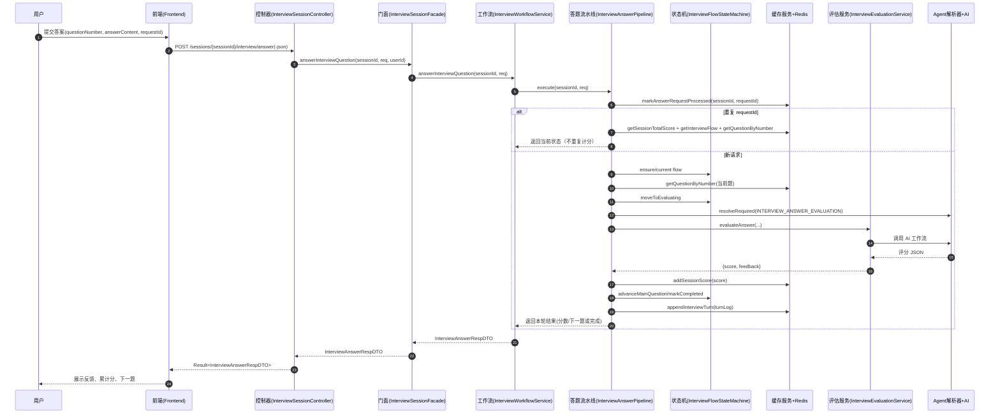
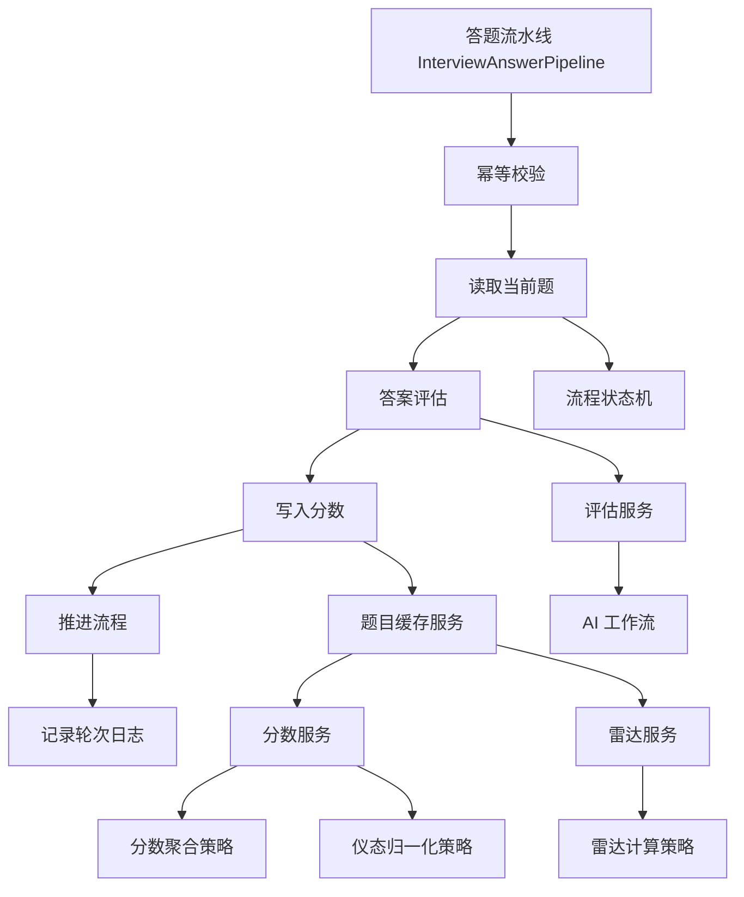
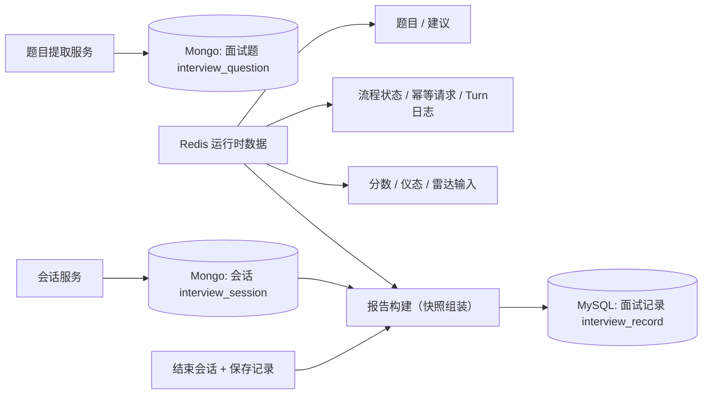
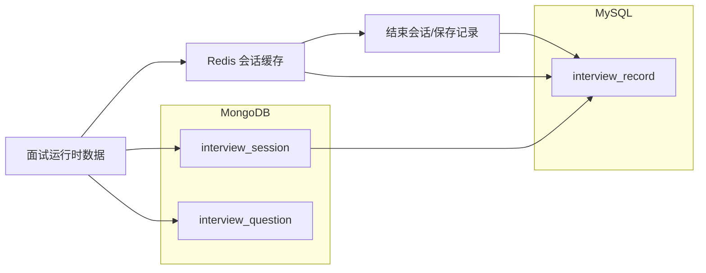

# Agent 面试流程图与架构图（后端）

## 1. 文档范围
- 目标：从时间维度描述 Agent 面试全链路，并展示运行时组件协作、过程产物、最终落库路径。
- 覆盖模块：`InterviewSessionController`、`InterviewSessionFacade`、`InterviewWorkflowService`、`InterviewAnswerPipeline`、`InterviewFlowStateMachine`、`InterviewQuestionCacheServiceImpl`、`InterviewRecordServiceImpl`。
- 约束：对外 API/DTO 不变，仅描述当前后端实现与重构后的内部编排。

## 2. 时间维度总览（E2E）

```mermaid
gantt
    title Agent 面试全流程时间线（单会话）
    dateFormat  X
    axisFormat %L

    section 会话初始化
    创建会话(DRAFT)                :a1, 0, 1

    section 简历与出题
    上传简历/提取问题(RESUME_UPLOADING) :a2, after a1, 2
    写入题库与缓存(READY)            :a3, after a2, 1

    section 面试进行中
    获取当前题(IN_PROGRESS)          :a4, after a3, 1
    每轮答题流水线(可重复N次)         :a5, after a4, 4
    姿态评估(可选并行)               :a6, after a4, 2

    section 收尾与报告
    结束会话(FINISHED)              :a7, after a5, 1
    从缓存组装记录并落库              :a8, after a7, 2
    报告查询/回放/雷达展示            :a9, after a8, 2
```

## 3. 答题主链路时序图（单轮）

## 4. 运行时组件架构图（拆分版，便于阅读）

### 4.1 总览（缩略）

```mermaid
flowchart LR
    FE[前端 Frontend] --> API[控制器 Controller]
    API --> Facade[会话门面 InterviewSessionFacade]
    Facade --> WF[面试编排 Workflow]
    Facade --> REC[报告服务 RecordService]
    WF --> PIPE[答题流水线 AnswerPipeline]
    WF --> EXT[题目提取 QuestionExtraction]
    WF --> DEM[仪态评估 DemeanorService]
    PIPE --> CACHE[缓存服务 QuestionCacheService]
    REC --> CACHE
    CACHE --> Redis[(Redis 缓存)]
    EXT --> AI[AI 工作流]
    DEM --> AI
    EXT --> Mongo[(MongoDB 文档库)]
    Facade --> Sess[会话服务 SessionService]
    Sess --> Mongo
    REC --> MySQL[(MySQL 报告库)]
```

### 4.2 编排与评分子图

### 4.3 存储与报告子图

### 4.4 读图建议（解决“图太大看不清”）
- 先看 4.1（总览），再按问题跳到 4.2 或 4.3。
- Mermaid 在部分 Markdown 渲染器里不支持缩放，这是渲染器限制，不是文档内容问题。
- 如果仍觉得大：继续把 4.2/4.3 再拆成“每步一图”即可。

## 5. 中间交互信息与产物

### 5.1 出题阶段
- 输入：`resumePdf`、`sessionId`、用户信息。
- AI 输出（结构化）：`questions`、`sugest/suggestions`、`type`、`resumeScore`、其他 resume context。
- 中间产物：
  - `questionsJson` / `suggestionsJson`（持久化）
  - Redis 问题映射、建议映射、简历分、方向、resume context
  - 初始化 flow：`INIT -> ASKING`

### 5.2 答题阶段（每一轮）
- 输入：`requestId`、`answerContent`、当前题上下文。
- 中间产物：
  - 幂等集：requestId 去重
  - 评估结果：`score` + `feedback`
  - 聚合分：`score_sum`、`score_count`、`totalScore`
  - 流程状态：`ASKING/EVALUATING/FOLLOW_UP/COMPLETED`
  - turn 日志：题号、题目、回答、分数、反馈、下一题、是否结束

### 5.3 姿态评估阶段（可选）
- 输入：`userPhoto`
- AI 输出：`panicLevel`、`seriousnessLevel`、`emoticonHandling`、`compositeScore`
- 中间产物：
  - 自动归一化（0-10 或 0-100）
  - Redis 姿态明细与综合分

### 5.4 收尾与报告阶段
- 动作：`finishSession` -> `saveInterviewRecordFromRedis`
- 产物：
  - 聚合报告记录 `interview_record`
  - `session_snapshot_json`（包含 flow、turns、radar、reviewFeedback）

## 6. 数据落库与缓存映射

### 6.1 Redis（会话期缓存，TTL 24h）
- 题目与建议
  - `interview:questions:session:{sessionId}`
  - `interview:suggestions:session:{sessionId}`
- 分数与方向
  - `interview:resume_score:session:{sessionId}`
  - `interview:demeanor_score:session:{sessionId}`
  - `interview:score:session:{sessionId}`
  - `interview:score_sum:session:{sessionId}`
  - `interview:score_count:session:{sessionId}`
  - `interview:direction:session:{sessionId}`
- 流程与幂等
  - `interview:flow:session:{sessionId}`
  - `interview:answer:req:session:{sessionId}`
- 回放与上下文
  - `interview:turns:session:{sessionId}`
  - `interview:resume_context:session:{sessionId}`
- 姿态明细
  - `demeanor:panic:{sessionId}`
  - `demeanor:seriousness:{sessionId}`
  - `demeanor:emoticon:{sessionId}`
  - `demeanor:composite:{sessionId}`

### 6.2 MongoDB
- `interview_session`
  - 会话主数据：`sessionId`、`userId`、`status`、`startTime`、`endTime`、`resumeFileUrl`、`interviewType`。
- `interview_question`
  - 出题持久化：`questions/questionsJson`、`suggestions/suggestionsJson`、`resumeScore`、`rawResponseData`、`responseTime`、`errorMessage`。

### 6.3 MySQL
- `interview_record`
  - 报告级记录：`interviewScore`、`resumeScore`、`questionCount`、`interviewSuggestions`、`interviewDirection`、`durationSeconds`、`sessionSnapshotJson`。

## 7. 最终落库链路图

## 8. 说明
- 流程状态（面试题流）：`INIT / ASKING / EVALUATING / FOLLOW_UP / COMPLETED`。
- 会话状态（业务会话）：`DRAFT / RESUME_UPLOADING / READY / IN_PROGRESS / FINISHED / ABANDONED`。
- 评分主逻辑：答题分按 0-100 加权平均（当前实现为聚合平均），仪态分支持 0-10 与 0-100 归一化，雷达由策略统一计算。
